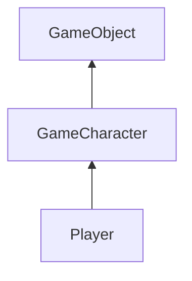
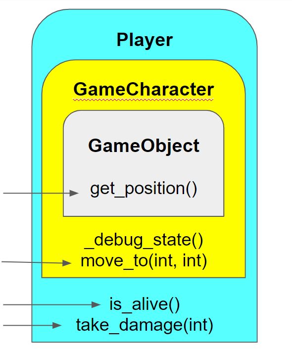
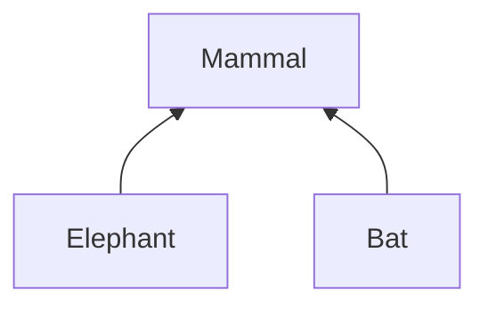
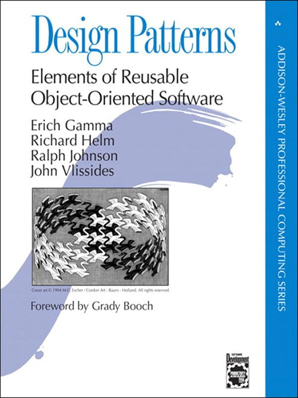
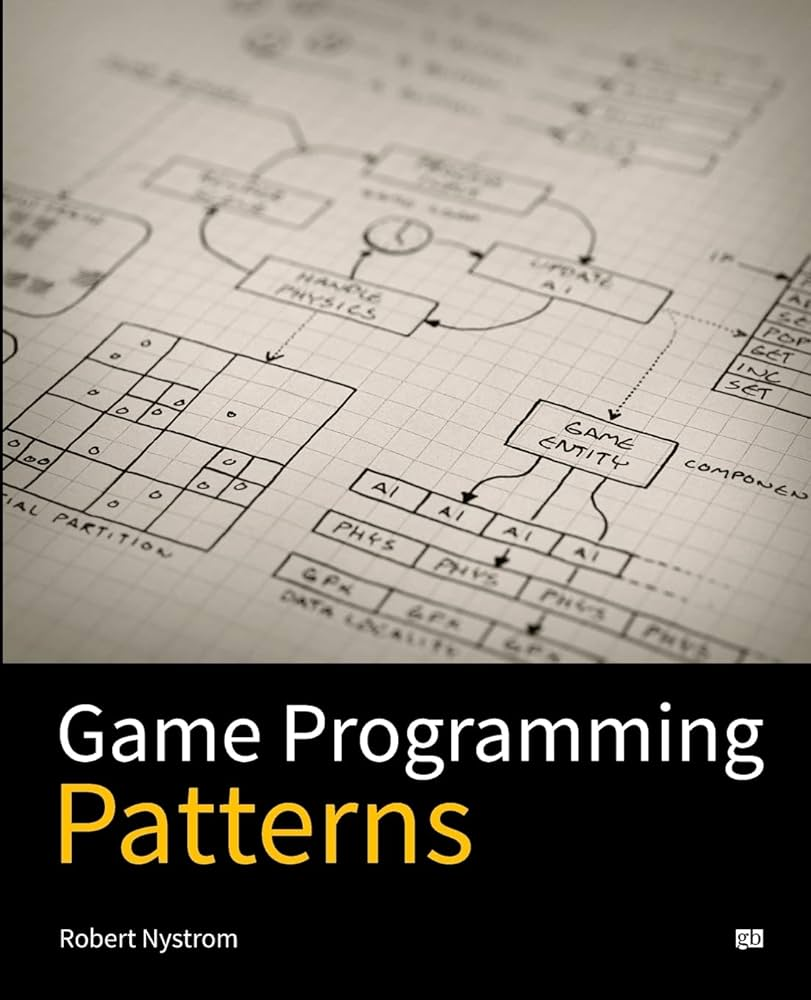

# Advanced OOP

--

## Agenda

- Inheritance
  - In general
  - Implementation Inheritance
    - And why you should not use it
  - Interface Implementation
- Class variables
- `staticmethod`
  - And maybe even `classmethod`

--

### If we have time

- `@property`
- Exceptions


---

### The problem with this lecture

Complicated subject, with many concepts, details, and common practices taken from various languages. 

But:

1. Python's OOP is weird and not intuitive.
2. Some of the common practices are really bad, and you should not do it.


---


## Inheritance # 1

The basic idea - one object (or class) shares the properties of another class

- We call these **Base Class** and **Derived Class**
- The _derived class_ **inherits** interface and maybe implementation from the _base class_
- The relationships this represents is **D is-a B*** {.fragment}
  - examples: A bird is an animal, A manager is an employee

--

### How would this look?

```python [1-6|8-18|20-28]
class GameObject():
    def __init__(self, initial_pos: tuple[int, int] = (0,0)):
        self._position = initial_pos

    def get_position(self):
        return self._position

class GameCharacter(GameObject):
    # Has all the functionalities of GameObject:
    # The same constructor and function get_position

    # Additional method
    def _debug_state(self):
        pass # something here

    def move_to(self, x, y):
        self._debug_state()
        self._position = (x,y)

class Player(GameCharacters):
    # Lets ignore the constructor for a moment 
    # and assume some `health` field

    def is_alive(self):
        return self._health > 0

    def take_damage(self, amount_of_damage):
        self._health -= amount_of_damage
```
--

### How it looks in a diagram?



--

### Another visualization to consider



conceptually: Objects contains instance of the base object{.fragment}

--

### How is this used?

```python
table = GameObject((0, 4))
horse = GameCharacter()
horse.move_to((2,5))

# we will discuss the constructor in a moment
player = Player((0,0), health=10)
# ...
player.move_to(2,5)
# Horsy kicks the player
player.take_damage(4)

for game_object in [table, horse, player]:
    print(game_object.get_position())
```

Objects share interface and implementation!{.fragment}

---

## Constructors are tricky

How should we use the `__init__` function?

--

Remember - base objet inside the derived object


We need to construct the inner object, in the constructor of the derived object.

```python{.fragment}
class GameCharacter(GameObject):
    def __init__(self, initial_pos: tuple[int, int] = (0,0)):
        self._position = initial_pos

    def get_position(self):
        return self._position
  
    def move_to(self, x, y):
        self._debug_state()
        self._position = (x,y)

class Player(GameCharacters):
    def __init__(
      self, 
      initial_pos: tuple[int, int] = (0,0), 
      health=10
    ):
        GameCharacters.__init__(self, initial_pos)
        self._health = health

    def is_alive(self):
        return self._health > 0
```

--

### Some syntactic sugar for this

```python
class Player(GameCharacters):
    def __init__(
      self, 
      initial_pos: tuple[int, int] = (0,0), 
      health=10
    ):
        super().__init__(initial_pos)
        self._health = health

    def is_alive(self):
        return self._health > 0
```

Notice: the `super()` replaced the class name,<br/>and the `self` was removed.


---

## Inheritance # 2

This is going to be our example



--

### bat does something interesting

```python
class Mammal():
    def __init__(self, name):
        self._name = name
        self._position = (0,0)

    def go_to(self, new_pos: Tuple[int,int]):
        self._position = new_pos
        print(f"{self._name} is walking to ${new_pos}")

class Elephant(Mammal):
    pass

class Bat(Mammal):
  def go_to(self, new_pos: Tuple[int,int]):
    self._position = new_pos
    print(f"{self._name} is flying to ${new_pos}")
```

--

### What just happened?

Elephant changed nothing - It's a new class with identical interface and functionality as it's base class.

Bat preserved the interface, but changed (overwrote) the implementation.

**The important things: inheritance allows to override the implementation of the base class.**

---

## But should we do it?

(Implementation inheritance, that is)

--

# No!!!

Well, that was simple{.fragment}
--

### but why?

1. Strong coupling between base and derived class - bad.
2. Deep inheritance trees are hard to understand and debug
   - Where is the implementation I'm searching for?
3. Multi implementation problems - the famous "Diamond problem"
4. Encapsulation violation.

--

Implementation inheritance is so bad<br>that [2 of the major modern programming languages](https://www.statista.com/statistics/793628/worldwide-developer-survey-most-used-languages/) (*go* and *rust*) **do not support it**.

--

### So what should we do?

1. Use **Interface Inheritance** - to share interfaces
   - `interface`s in Java
   - `ABC` in Python
2. We use **Composition** - to share implementation
   - Having other objects **AS FIELDS** of a bigger object
   - Call external functions

---


## Inheritance # 3

```python
from abc import ABC, abstractmethod

class Eats(ABC):
    @abstractmethod
    def eat(self, food):
        pass # can also raise NotImplementedError

class Sensing(ABC):
    @abstractmethod
    def look_at(self, direction):
        pass

    @abstractmethod
    def taste(self, something):
        pass

class Thinking(ABC):
    @abstractmethod
    def learn(self, new_thing):
        pass

    @abstractmethod
    def is_moral(self, action):
        pass

```

--

### And the implementation

```python
import Eats, Sensing, Thinking

def no_taste():
    print("No taste at all")

class Eagle(Eats, Sensing):
    def eat(self, food):
        if food == "meat":
            print(f"Eagle is eating {food}")
        else:
            print(f"Eagle is not eating {food}")

    def look_at(self, direction):
        print(f"Eagle is looking at {direction} and sees all")

    def taste(self, something):
        no_taste()

class Horse(Eats, Sensing):
    def eat(self, food):
        if food == "grass":
            print(f"Horse is eating {food}")
        else:
            print(f"Horse is not eating {food}")

    def look_at(self, direction):
        print(f"Horse is looking at {direction} and sees nicely")

    def taste(self, something):
        no_taste()

class Human(Eats, Sensing, Thinking):
    def eat(self, food):
        print(f"Human is eating {food}")

    def look_at(self, direction):
        print(f"Human is looking at {direction}")

    def taste(self, something):
        if something == "pizza":
            print("Best thing!!!! ever!!!!")
        else:
          print(f"Human is tasting {something}")

    def learn(self, new_thing):
        print(f"Human is learning")

    # also "is_moral"...
```

--

Inspiration for the previous example is [here](https://he.wikisource.org/wiki/%D7%94%D7%A7%D7%93%D7%9E%D7%AA_%D7%94%D7%A8%D7%9E%D7%91%22%D7%9D_%D7%9C%D7%9E%D7%A1%D7%9B%D7%AA_%D7%90%D7%91%D7%95%D7%AA_(%D7%90%D7%91%D7%9F_%D7%AA%D7%99%D7%91%D7%95%D7%9F))

{.fragment}{.fragment fade-out}
{.fragment}

---

## Inheritance comments

There are exceptions to this.

Specifically, when we are talking about **frameworks** and **libraries**.

For instance in python there are `Mixin` classes, which are used to add functionality to classes. And if you ever learn **Django** - you will have to use it.


---

Questions?

---

# Other OOP concepts

---

## Class Variables

what is this?

```python
class Circle:
    pi = 3.14

    def __init__(self, center: Tuple[float, float], r: float):
        self._radius = r

    def diameter(self):
        return 2 * self._radius
    
    def area(self):
        return self.pi * self._radius ** 2
        # return Circle.pi * self._radius ** 2

```
--

### Interesting usage example

```python
class Monster:
  monster_count = 0

  def __init__(self, name, health):
    self._name = name
    self._health = health
    Monster.monster_count += 1

  # ...

  def get_num_of_monsters(self):
    return Monster.monster_count
```

--

You can do this with `self` too

(Which is very confusing)

```python [7]
class Monster:
  monster_count = 0

  # ...

  def get_num_of_monsters(self):
    return self.monster_count # This is confusing. Avoid this
```

--

### What happens in inheritance?

class variables are shared between the base and derived classes

```python
class Animal:
    species_count = 0  # Class variable

class Dog(Animal):
    pass

class Cat(Animal):
    pass

# All classes share the same species_count
print(Animal.species_count)  # Output: 0 (initial value)
print(Dog.species_count)    # Output: 0
print(Cat.species_count)    # Output: 0
```

---

## Class methods

If we can have variables on the class, why not methods?

--

lets look at this example - **factory methods**

```python [8]
class Question:
  # bad params names for fit in screen
  def __init__(self, q: str, correct: str, wrongs: List[str]):
    self._question = q
    self._answer = correct
    self._wrong_answers = wrongs

  # ... Some methods for asking and printing

  def print_question(self):
    # ...
    pass
  
  def ask_user_for_answear(self):
    # ...
    pass

  @classmethod
  def from_dict(cls, data: dict):
    return cls(
      data['question'],
      data['correct'],
      data['wrongs']
    )

  @classmethod
  def from_json_file(cls, path: pathlib.Path):
    with open(path, 'r') as f:
      data = json.load(f)
      return cls.from_dict(data)

  @classmethod
  def list_from_json_file(cls, path: pathlib.Path):
    with open(path, 'r') as f:
      data = json.load(f)
      return [cls.from_dict(q) for q in data]


```
Notices the `cls` argument {.fragment}

--

### How is this used?

```python
q1 = Question.from_dict({
  'question': 'What is the capital of France?',
  'correct': 'Paris',
  'wrongs': ['London', 'Jerusalem']
)}

q2 = Question.from_json_file('single_question.json')


```


--

### Important notes

- Unlike a constructor - a class method can return any object
- These are inherited might create a mess

--

### You can also have `staticmethod`

```python
class Math:
  @staticmethod
  def add(a, b):
    return a + b

  @staticmethod
  def sub(a, b):
    return a - b
```

- No `self` or `cls` arguments {.fragment}
- These are not inherited {.fragment}

Not going to deep on this. Read yourself.

---

Questions?

---

# I want to show you something

--

```python
class Logger:
  _instance = None

  # start with the functionality, constructor later
  
  def log_message(self, message:str, level: str = "INFO"):
    self._log.append(message)

  def flush_to_file(self, file_path: pathlib.Path):
    with open(file_path, 'w') as f:
      f.write('\n'.join(self._log))

  # and now for the interesting part

  def __init__(self):
    if Logger._instance is not None:
      raise Exception("Singleton class. Please use `get_instance`")
    
    self._log = []
    Logger._instance = self

  @classmethod
  def get_instance(cls):
    if cls._instance is None:
      cls._instance = cls()
    return cls._instance

```

--

### How would you use this?

```python
logger = Logger.get_instance()
logger.log_message("Hello")
logger.log_message("World")

# the exact same object. Not a copy. reference to same object
logger2 = Logger.get_instance()
logger2.log_message("Another message") # on the same list

logger3 = Logger() # throws error!!
```


This class has only one instance. And to access it you should use the `get_instance` method. {.fragment}
 
This is called a **singleton** class<br/>and it is a known design pattern{.fragment} 

--

## What are design patterns?

A general reusable solution to a commonly occurring problem within a given context in software design.

In other words: it is a known and tested design choices, you can use to solve a common problem.{.fragment}

Exists in many fields, not just programming. {.fragment}

you can get a list [here](https://en.wikipedia.org/wiki/Software_design_pattern). {.fragment}


--

#### The classic book:




--

#### And other book that I like


But you can read it **for free** [here](https://gameprogrammingpatterns.com/contents.html)


--

Im not here to teach you design patterns. But I want you to know they exist, and you can use them.

Also, don't force them. When you use them wrong (or when not appropriate) you can make a mess.{.fragment}


---


# syntactic sugar:

## `@property` in Python

--

Basically: an easy way to create a getter

In other words: allows you turn a method into a property/field, and so uphold encapsulation.


```python
class Player:
  def __init__(self, img_path: Path, health: int, strength: int):
    self._img_path = img_path
    self._health = health
    self._strength = strength

  def take_damage(self, damage):
    self._health -= damage
  
  def is_alive(self):
    return self._health > 0

  @property
  def strength(self):
    return self._strength

p = Player('player.png', health=100, strength=10)
print(p.strength)  # 10
print(p._strength)  # 10
# print(p.strength()) # wont work - exception
# p.strength = 12  # wont work - exception
```


--

There is also a way to create a `setter` but I don't want to go into this


---

# Exceptions

You should know it from other language. This is just an adapter to python

--

## try-except

In other languages (that have exceptions) you have `try-catch` blocks

```python
def get_file_content(file_path: str)
  try:
    f = open(file_path, 'r')
    return f.read()
    
  except FileNotFoundError: # handle specific exception
    return None 

  except Exception as e: # handle all exceptions, and bind to var
    print(f"Error: {e}")
    return None
  
  finally: # This will happen in either case
    f.close()

```

--

### How to raise an exception, and what kind?

- `raise` keyword
- you can use one of the [built-in exceptions](https://docs.python.org/3/library/exceptions.html#exception-hierarchy) {.fragment}
   - `TypeError` and `ValueError` are popular
   - When not sure, use `RuntimeError`. It's the best
- You can write your own exception class {.fragment}
   - Don't forget to inherit from `Exception`

---

questions?