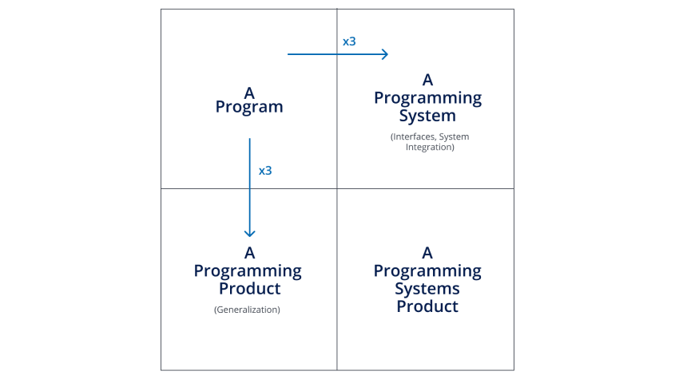
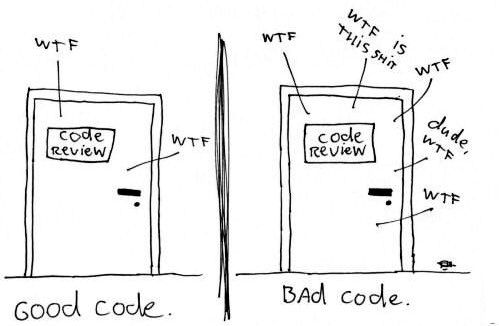

# Clean Code

> Based mostly on Robert C. Martin, chapters 1-5{.fragment}

---

## Before we start:
## What are we writing?

> Based on the Mythical Man-month by A. brooks {.fragment}

--

### program

A piece of code that is written to solve a problem.

--

### programming product

A piece of code written for a **CLIENT** (not necessary a programmer) to solve his problem.

Possibly includes:

1. User interface{.fragment} 
2. Documentation{.fragment} 
3. Acceptance tests{.fragment} 
4. Support{.fragment} 

--

### programming system

**MULTIPLE** pieces of code written in **COLLABORATION** with others, **OVER TIME**, to solve an (evolving) problem.

Possibly includes:

1. Design and interfaces (between the different parts){.fragment} 
2. Internal Documentation{.fragment} 
3. Unit tests{.fragment} 

This is where clean code becomes important, as time spent reading is 10x the time spent writing (according to uncle Bob){.fragment}

--

### programming system product

You get the idea: a combination of the programming system and product

--

In a chart:




---

## So, Why do we need clean code?


- Because code is written once and read many times (1:10 ratio according to uncle Bob).{.fragment}
- Because code is written over time, and by different people.{.fragment}
- Because code changes. Constantly. And a lot.{.fragment}


---

# Chapter 1:

## What is clean code and how do you measure it?

--



> Write your code as if the man maintaining it is a psychopath with a chainsaw who knows where you live{.fragment}

--

What I used to tell my team:

The grade for you're code is 60%-80% from the next developer to work on it, the rest from the client that uses it.{.fragment}

--

### Some useful metrics and ideas:

1. No surprises - does what you expect
2. Clearly explains ideas

--

### Some others

1. Written by someone that cares
2. Expresses the design ideas
3. Minimum dependency (this is in design)

---

## Some comments before we're getting prescriptive:

::: {.incremental}
- Guidelines over dogma{.fragment}
- Conventions trump strict adherence{.fragment}
- Don't forget your tools: the IDE, git, etc..{.fragment}
- Communication, that is making your ideas *clear and distinct*, takes effort.{.fragment}
  - Don't count on the first draft

---

Most important rule is _the boy (and girl) scout rule_:

### Leave the trail/playground/code cleaner than it was when you found it{.fragment}


---

# Chapter 2: Meaningful Names

--

## Basic guidelines


* You should spend more time picking good names. They save a lot of time.
* Don't be afraid of long names. Long names are better than long comments.
* It's ok to use standards (like `i` a   nd `j` for indexes in loops).
* These things are debatable - come to the table with some modesty.

---

## Intention revealing names

Names should provide information, and not hide it.

```python
def is_document_relevant(c):
  if c > 864000
    return False
  return True
```

What is `c`? what is `864000`?{.fragment}

--

Lets try this again

```python
SECONDS_IN_DAY = 86400

def is_document_relevant(seconds_since_creation):
  if seconds_since_creation > SECONDS_IN_DAY * 10
    return False
  return True
```

---

### Avoid disinformation

The most blatant example is lying. What is the lie here?

```python
def my_functions(players):
  active_players_set = []
  for player in players:
    if player.is_active():
      active_players_set.append(player)
```
players is a list, not a set{.fragment}

--

#### And then there are all kinds of confusion:

```python
def check_if_exists(elem, array):
  # some code here
```
There are no arrays in python, only lists.{.fragment}

Another example for confusion: creating a class named `Player` and another `Players` in the same file{.fragment}
--

Another confusing example

```python
# A class definition
class Player:
  def __init__(self, name: str):
    self._name = name
    self._score = 0
  # more code...
```


```python
# and some time later, in function, I get this
current_player = ...
```

What was the type of current_player?

It was `int`. The value was `current_player = 1` {.fragment}

---

### Meaningful Distinctions

```python
def expand_lists(list1, list2):
  """Merge one list into the other"""
  #some code
```
Which list is merged into which?

```python{.fragment}
def expand_lists(source_list, destination_list):
  #same code
```

---

### Pick on word per concept

- Are you `get`ting data or `fetch`ing it?{.fragment}
- Do you have `manager`s or `controller`s?{.fragment}

--

### For classes and methods

- Classes and objects should have **noun** names
- Methods and functions should have **verb** names
  - with some standards for classes: `get_` for getters, `is_` for boolean getters, `set_` for setters etc.

--

### Solution Domain Names vs. Problem Domain Names

---


### Some more Naming guidelines

- Use pronounceable names
- Use searchable names
- Don't be cute/use puns

---

# Functions

---

# Comments

1. The basic truth: when we update the code, we often forget to update the comments
1. Dont write comments that explain what the code already explains
2. comments becomes a noise that I learn to ignore

---

# Classes & Objects vs. Data Structures

---

# Formatting

---

# Additional guidelines

--

Interface inheritance vs implementation inheritance